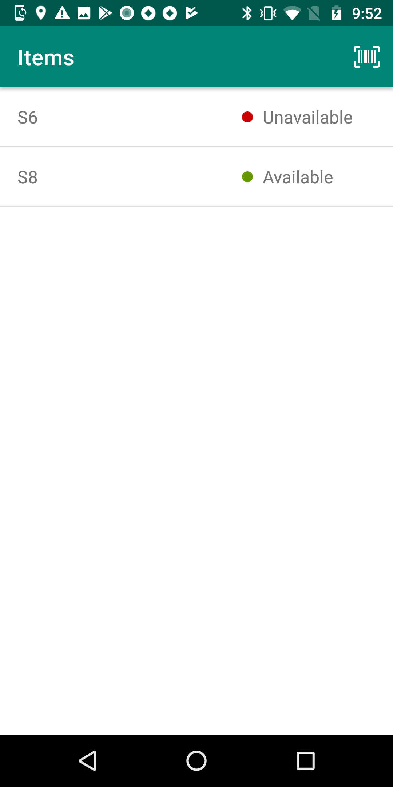
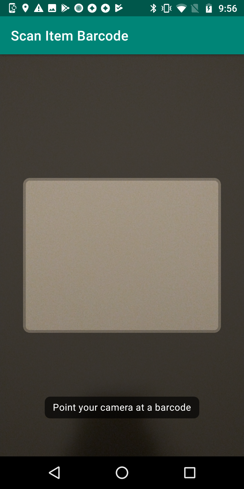

# Checkout Android [UNDER DEVELOPMENT]

This is an android app that allows you to manage an inventory of items.

## What does this app do?
Users can automatically check in and out items by scanning its barcode.

## Use case
I have worked in various companies where there has been difficulty tracking testing devices used across
different mobile teams. By assigning a unique barcode to each device and having a checkout device hosting
this app, it should be easier to track them. Similarly, other items can be tracked using this app
by the office admin.

## Technologies & libraries used:

### Backend
As a beginner to backend development, I used this project to explore building an API, and other new areas 
without making things far too complicated. Unfortunately, it is not as sophisticated as I hoped but it 
gets the job done and follows the ideal practices.

<ul>
<li>Ruby on Rails</li>
<li>RSpec</li>
<li>PostgreSQL</li>
<li>Heroku</li>
</ul>

### Android
<ul>
<li>Retrofit</li>
<li>Firebase</li>
<li>Kotlin</li>
</ul>

### TBD/Nice to have
- [ ] add the name of the user when item is being signed out; update API and db
- [ ] add the ability to add new items to the inventory by scanning its barcode
- [ ] use Room for database
- [ ] use MVVM & Dagger/Toothpick
- [ ] expand on the rails app; make a page that allows you to view and edit inventory (add/delete items)
- [ ] add image to item resource

## GIFs & screenshots

| Demo | List of items screen | Barcode scan screen |
| ------------- | ------------- | ------------- |
|  |  |  |
